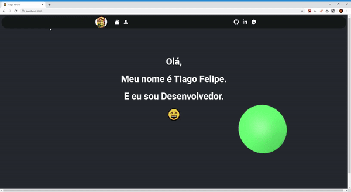

 
<h3 align="center">
  MyWebPage in ReactJS
</h3>

  

  

 

  
 

Essa pagina foi uma maneira de testar e por em pratica conhecimentos adquiridos em React atraves dos ultimos meses. O objetivo foi fazer uma aplicação simples mas com um sentido e significado

A aplicação esta hospedada no **[https://tiagofelipedev.web.app/](https://tiagofelipedev.web.app/)**

Caso deseje rodar a aplicação em ambiente local, bastar fazer um `clone` desse repositorio e ao final rodar `yarn` para instalar as dependencias, e depois `yarn start` para iniciar a aplicação.

Feito com ❤️ by Tiago Felipe

